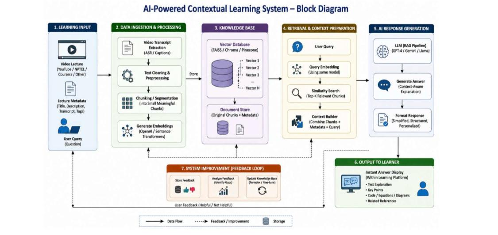
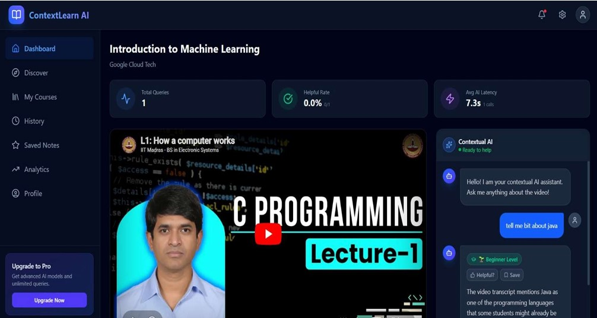
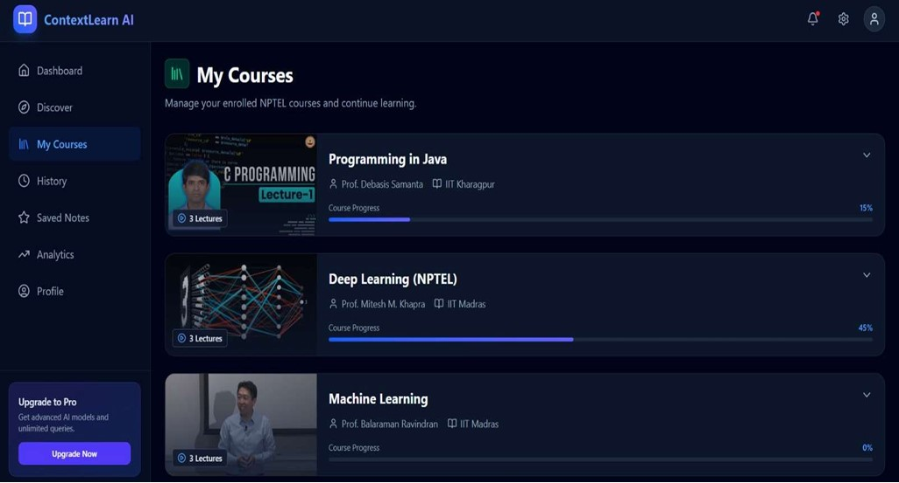
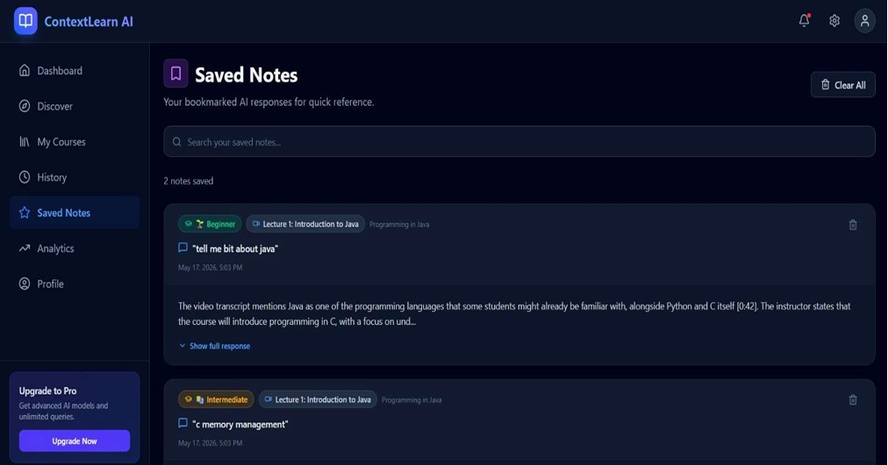
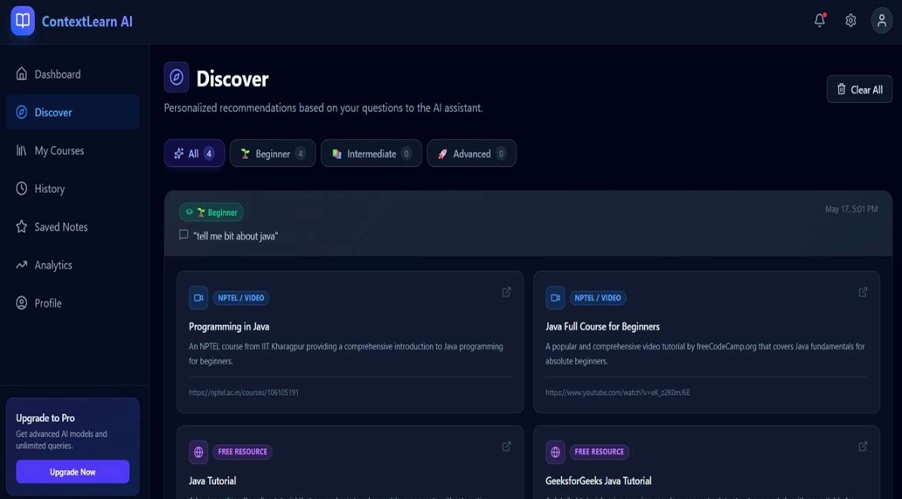

# AI Contextual Learning 🚀

An AI-powered contextual learning platform designed to revolutionize how students interact with video lectures. By leveraging Retrieval-Augmented Generation (RAG), this platform allows users to ask questions in real-time while watching a lecture and receive instant, context-aware explanations based on the video's transcript.

## 🌟 Why This Over Traditional Platforms?

Traditional e-learning platforms (like standard YouTube or NPTEL portals) offer one-way communication. If a student is confused, they must pause, open a new tab, search the web, and hope to find an answer relevant to the specific context of the lecture. 

**ContextLearn AI** bridges this gap:
- **Instant Contextual Q&A:** Ask questions directly alongside the video. The AI knows exactly what the professor is talking about using transcript-based semantic search.
- **Personalized Recommendations:** Based on the questions you ask, the system recommends beginner to advanced resources to fill your knowledge gaps.
- **Centralized Knowledge:** Save AI responses as structured notes and bookmark them for revision.
- **Progress Tracking:** Seamlessly manage all your NPTEL and YouTube courses in one dashboard.

---

## 🏗️ Architecture & How It Works

The platform utilizes a state-of-the-art **Retrieval-Augmented Generation (RAG)** pipeline.



1. **Data Ingestion:** Video transcripts (captions/ASR) are extracted from YouTube/NPTEL lectures.
2. **Text Processing & Chunking:** Transcripts are cleaned and segmented into meaningful, overlapping chunks.
3. **Embeddings & Vector Database:** Chunks are converted into vector embeddings and stored in a Vector DB (like FAISS, Chroma, or Pinecone).
4. **Contextual Retrieval:** When a user asks a question, the query is embedded, and the top-K most relevant transcript chunks are retrieved.
5. **AI Generation:** The LLM (Gemini/GPT-4) uses the retrieved context to generate an accurate, structured, and personalized explanation.

---

## 📸 Platform Previews

### 1. Interactive Learning Dashboard
Watch lectures and interact with the Contextual AI Assistant simultaneously.


### 2. Course Management
Manage enrolled courses, track progress, and resume learning instantly.


### 3. Saved Notes
Bookmark AI explanations and categorize them by difficulty (Beginner, Intermediate, Advanced) for quick reference.


### 4. Discover Personalized Content
Get customized video and article recommendations based on the concepts you struggle with.


---

## 💻 Tech Stack

- **Frontend:** React.js, Vite, TailwindCSS (or Vanilla CSS)
- **Backend:** Node.js, Express.js, MongoDB (Mongoose), JWT Authentication
- **AI & Vector Service:** Python, FastAPI/Flask, Google Generative AI / OpenAI, Vector Database
- **APIs:** YouTube Transcript API

---

## 🚀 Getting Started

### Prerequisites
- [Node.js](https://nodejs.org/) (v18+)
- [Python](https://www.python.org/) (v3.8+)
- MongoDB (Local or Atlas)

### 1. Clone the repository
```bash
git clone <your-repository-url>
cd ai-contextual-learning
```

### 2. Backend Setup
Navigate to the backend directory, install dependencies, and set up your environment variables:
```bash
cd ai-contextual-learning/backend
npm install

# Create a .env file and add your configuration (PORT, MONGO_URI, API_KEYS)
# Example:
# PORT=5000
# MONGO_URI=your_mongodb_connection_string
# GEMINI_API_KEY=your_api_key

npm run dev
```

### 3. Frontend Setup
Navigate to the frontend directory and start the dev server:
```bash
cd ../frontend
npm install
npm run dev
```

### 4. Vector Service Setup
Navigate to the vector service, set up a virtual environment, and run it:
```bash
cd ../vector_service
python -m venv venv

# Activate venv: 
# Windows: venv\Scripts\activate 
# Mac/Linux: source venv/bin/activate

pip install -r requirements.txt
python app.py
```
